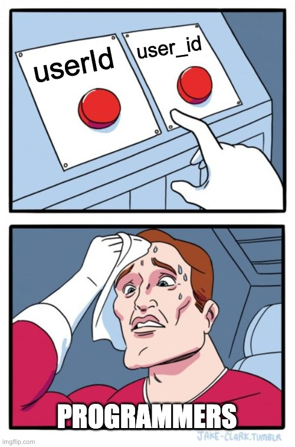

# 1. Hello World

- 자바를 설치하는 방법은 굉장히 다양하다. 가장 간단한 방법은 `IntelliJ IDEA`를 통한 설치다.
- 프로그래밍을 배울 때 가급적 영어 사용을 권장한다. 익숙해져야 하며, 생산성 차이가 크다. 더 빠르게 퇴근하고 싶지 않은가?
- 정적 분석, 추론

```java
public class HelloWorld {
    public static void main(String[] args) {
        System.out.println("Hello World!");
    }
}
```

- `class`, `static`, `void`, `args`
- 프로그램은 반드시 `시작점`이 필요하다. 여행을 시작할 때 첫 발을 내딛듯, 자바 프로그램은 `main`메서드에서 출발한다. `main`메서드 안에 컴퓨터에게 지시할 행동을 작성한다.
- 예를들어 위 코드에서 `main`메서드는 여행의 출발점이고, `System.out.println`은 행동이다.

**중괄호와 큰따옴표**

- 중괄호는 행동의 범위, 공간을 정의한다. 예를들어 책을 펼쳐보자. 중괄호는 한 챕터에 해당하는 내용이다.
- 큰따옴표는 전달하고 싶은 메시지를 감싸는 도구다. 큰따옴표 안에 작성된 내용은 컴퓨터에게 직접 전달하는 말이다. 예를 들어 `"안녕하세요"`는 컴퓨터에게 `안녕하세요`를 전달하고 싶다는 의미다.

**세미콜론**

- 세미콜론은 문장의 마침표다. 컴퓨터는 똑똑해보이지만 생각보다 단순하다. 문장의 끝을 스스로 찾지 못한다. 전달하고 싶은 메시지를 `0`, `1`로 변환하고 실행할 뿐이다.
  따라서 세미콜론을 통해 하고싶은 말이 `여기서 끝났다` 표현해야 한다.

**들여쓰기와 주석(Comment)**

앞서 컴퓨터와 소통하는 간단한 도구를 배웠다. 들여쓰기와 주석은 우리끼리 소통하기 위한 도구다.

- `들여쓰기`는 컴퓨터 입장에서 관심 없다. 하지만 우리는 '동작하는 코드'를 넘어 '읽기 좋은 코드'를 작성할 필연적 의무를 갖는다. 함께 살아가는 상대방에게 다정함을 표현하면 어떨까?
- 주석은 인간끼리 코드를 이해하고 소통하기 위한 도구다. 컴퓨터는 주석에 관심 없다. 주석을 통해 '의도'를 표현한다.
    - single line comment
    - multi line comment
- 코드는 기본적으로 읽어야 한다. 하지만 주석이 포함되면 주석도 읽어야 한다. 읽어야 할 요소가 증가한다. 피로도도 함께 증가한다. 따라서 가급적 코드로 의도를 전달할 수 없는지 먼저 고민하자.

## 운영체제 독립성과 JVM

자바의 `JVM`은 번역가다. 예를들어 영어로 작성한 글을 `JVM`이 번역해서 `Windows`, `macOS`, `Linux` 모두 읽을 수 있도록 돕는다. 번역가 덕분에 어떤 운영체제에서도 동일한
코드를 실행할 수 있다.

운영체제의 독립성 덕분에 소스 코드를 작성하는 운영 체제와 서버 운영체제가 달라도 문제가 발생하지 않는다.

# 2. Variable

- 변수를 왜 사용할까?
- 변수 초기화, 선언, 대입

## Start of variable

```java
int a = 10000;

int maxCaloriePerDay = 10000;
boolean isDietPlanActive = true;
```

> 변수는 왜 필요할까?

- 기술 도입은 주로 '유지보수에 용이하다'라고 요약한다. 하지만 일상에서 '그냥'과 같다고 생각한다. 표현을 다듬어보자. 변수는 의미전달을 위해 필요하다.
- 값을 그대로 사용하면 의도 전달에 난항을 겪는다.
- 특히 자주 사용하는 값을 다룰 때 변수를 사용하면 한번에 변경이 가능하여 유용하다.

### TL;DR

**패키지(Package)**

> 패키지를 사용하는 이유는 무엇일까?

- 패키지를 통해 비슷한 성격의 객체를 분류한다.

**등호(Equality sign) vs. 대입 연산자(Assignment Operator)**

$$
x = 5
$$

- 수학에서 등호는 `=`이다. 자바 세계에서 `=`는 대입 연산자다.

```java
int x = 5;
```

**변수의 소멸 시점(Variable Scope and Lifetime)**

- 지금까지 학습한 변수는 지역 변수(Local Variable)다. 이후 배우는 변수의 유형에 따라 소멸 시점이 다르다.
- 가비지 컬렉션(Garbage Collection)이 메모리를 관리한다. 스코프와 참조 상태에 의해 결정된다.

## Change variable value

- 메모리 관점에서 할당된 값을 변경할 때, 값을 어디로 사라질까?

## Variable declaration and initialization


> 머리로 풀더라도 결국 손이 리듬을 기억해야 한다.

- 초기화(Initialize), 선언(Declaration), 할당(Assignment)
- 변수 이름은 메모리 관점에서 '식별자(identifier)'다.
- 선언과 할당을 나눠 진행할 수 있다. 하지만 가급적 선언과 할당은 동시에 진행하자.
- 왜 지역 변수는 개발자가 직접 초기화 해야할까?
- 에러에도 종류가 있다? 컴파일 에러 vs. 런타임 에러
- 최적화, 사용하지 않을꺼야? 꺼져.

## Variable type 1

- `String`은 왜 그럴까? 너 뭐 돼?
- 타입은 용도에 맞게 사용한다. 떡볶이 그릇에는 떡볶이를, 국그릇에는 국을, 용도에 맞지 않는 사용은 허용하지 않는다.
- 리터럴(Literal): 문자 값

## Variable type 2

- 변수가 허용하는 범위가 넓을수록 메모리 공간을 많이 사용한다. 용도에 맞게 사용하자.
- 자주 사용하는 자료형
- 외우지 않아도 된다. 맥락을 이해하자.
- 선택과 집중이 필요하다. 사용하지 않는 요소는 우선순위에서 밀린다. 모든 내용을 암기하기 보단 반복으로 이해를 중점으로 학습하자.

## Variable naming conventions



- 예약어란?
- 변수 이름은 왜 중요할까? 의도?

## Summary

### AS-IS

- 변수는 명료한 의사를 전달하는 첫 발자국이다. `naming`을 꾸준히 연습하고 고민하자.
- 외우지 말고 상황에 따라, 타입에 맞게 사용하자.

### TO-BE

- 용어를 정리하자 정리하자.
- 변수 타입을 분류하자. 자주 사용하는 타입
- Code Conventions

## See also

# 3. Operator

## Increment/Decrement operator

- 증감은 자주 발생한다. 편의성을 제공한다.
- 증감 연산자는 읽기 좋은 코드에 부합할까?
- 연산자의 위치에 따라 연산 수행 시점이 달라진다. 전위(Prefix), 후위(Postfix)

## Comparison Operators

- 비교 연산자는 두 값을 비교할 때 사용한다.
- 문자열은 `==`이 아닌 `equals`를 사용해야 한다. 왜 그럴까? 특정한 조건에 왜 실패할까?

## Logical Operators

- 자바는 단축 평가를 하지 않을까? 언어에 상관없이 단축 평가는 암묵적으로 진행될까?

## Summary

- 자주 사용하는 연산자
    - 산술 연산자
    - 증감 및 감소 연산자
    - 비교 연산자
    - 논리 연산자
    - 대입 연산자
